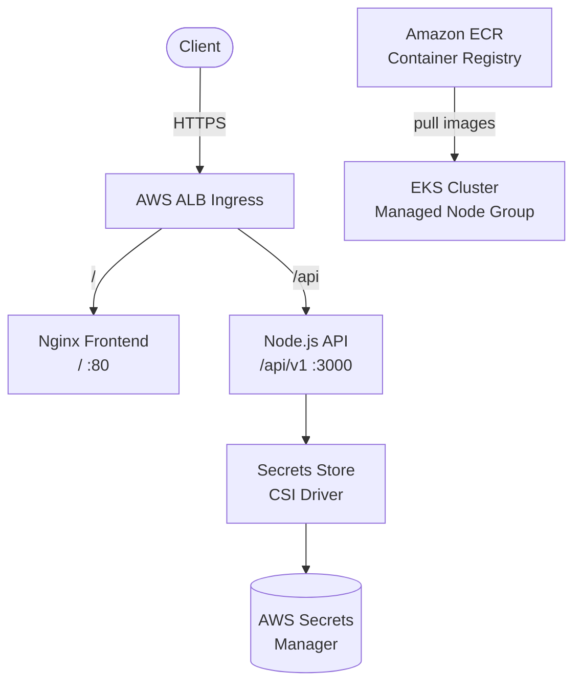

# k8s-eks-platform

> A production-grade Kubernetes platform for containerised microservices on AWS EKS — built to demonstrate infrastructure-as-code, GitOps CI/CD, secrets management, and auto-scaling best practices.

[](https://github.com/Mandrupnicolai/k8s-eks-platform/actions/workflows/ci.yml)
[](https://github.com/Mandrupnicolai/k8s-eks-platform/actions/workflows/cd.yml)
[](https://codecov.io/gh/Mandrupnicolai/k8s-eks-platform)
[](https://developer.hashicorp.com/terraform)
[](https://helm.sh)
[](https://kubernetes.io)
[](https://aws.amazon.com/eks/)
[](https://nodejs.org)
[](LICENSE)
[](https://github.com/Mandrupnicolai/k8s-eks-platform/commits/master)
[](https://github.com/Mandrupnicolai/k8s-eks-platform/issues)

---

## Contents

- [Features](#features)
- [Architecture](#architecture)
- [Getting started](#getting-started)
- [Configuration](#configuration)
- [Kubernetes & Helm deployment](#kubernetes--helm-deployment)
- [CI/CD pipeline](#cicd-pipeline)
- [API reference](#api-reference)
- [Contributing](#contributing)

---

## Features

- **Containerised microservices** — Node.js REST API and Nginx frontend, each independently deployable
- **AWS EKS via Terraform** — fully automated cluster provisioning with VPC, managed node groups, and IRSA
- **Helm chart** — fully parameterised across dev / staging / prod, no hardcoded values anywhere
- **Horizontal Pod Autoscaler** — CPU and memory-based scaling from 1 to 10 replicas per service
- **AWS Secrets Manager** — secrets mounted at runtime via Secrets Store CSI Driver, never in source control
- **GitHub Actions CI/CD** — lint, test, Docker build, Terraform validate, ECR push, Helm upgrade
- **OIDC-based AWS auth** — no static credentials; GitHub Actions assumes an IAM role via OIDC
- **Jest** unit tests with Codecov coverage reporting

---

## Architecture



---

## Getting started

### Prerequisites

| Tool       | Version  | Install |
|------------|----------|---------|
| AWS CLI    | >= 2.15  | [docs](https://docs.aws.amazon.com/cli/latest/userguide/getting-started-install.html) |
| Terraform  | >= 1.7   | [docs](https://developer.hashicorp.com/terraform/install) |
| kubectl    | >= 1.29  | [docs](https://kubernetes.io/docs/tasks/tools/) |
| Helm       | >= 3.15  | [docs](https://helm.sh/docs/intro/install/) |
| PowerShell | >= 7.0   | [docs](https://learn.microsoft.com/en-us/powershell/scripting/install/installing-powershell) |
| Node.js    | >= 20    | [docs](https://nodejs.org/) |

### Run the API locally

```bash
cd services/api
npm install
npm start
curl http://localhost:3000/health
```

### Run tests

```bash
cd services/api
npm test
```

---

## Configuration

All configuration is supplied via environment variables or Helm values — nothing is hardcoded.

| Variable      | Default       | Description                        |
|---------------|---------------|------------------------------------|
| `PORT`        | `3000`        | API HTTP port                      |
| `APP_ENV`     | `development` | Runtime environment label          |
| `AWS_REGION`  | `us-east-1`   | AWS region for SDK calls           |

In Kubernetes, non-sensitive values come from Helm values and the sensitive values (database credentials, API keys) are mounted from AWS Secrets Manager into `/mnt/secrets/` via the Secrets Store CSI Driver.

Secret path convention: `/k8s-eks-platform/{environment}/{secret-name}`

---

## Kubernetes & Helm deployment

> **Note:** The deploy stage in CI requires AWS secrets and variables to be configured in GitHub.
> The CD job includes a preflight check and skips gracefully when credentials are absent.
> See [Enabling deployment](#enabling-deployment) below to activate it.

### Bootstrap the cluster (first time only)

```powershell
# 1. Provision infrastructure
cd terraform
terraform init `
  -backend-config="bucket=your-tf-state-bucket" `
  -backend-config="key=k8s-eks-platform/terraform.tfstate" `
  -backend-config="region=us-east-1" `
  -backend-config="dynamodb_table=terraform-state-lock"
terraform apply -var-file="environments/dev.tfvars"

# 2. Install cluster add-ons
./scripts/bootstrap.ps1 -ClusterName my-eks-cluster -AwsRegion us-east-1
```

### Deploy the application

```powershell
./scripts/deploy.ps1 `
  -ClusterName my-eks-cluster `
  -AwsRegion   us-east-1 `
  -Environment dev `
  -ImageTag    latest
```

### Enabling deployment in CI/CD

1. Provision an EKS cluster using the Terraform module in `/terraform`
2. Create an ECR repository for each service (`api`, `frontend`)
3. Set up an IAM role with OIDC trust for GitHub Actions (see OIDC trust policy below)
4. Add the following GitHub Actions secrets and variables:

**Secrets:**

| Secret                | Description |
|-----------------------|-------------|
| `AWS_DEPLOY_ROLE_ARN` | IAM role ARN assumed via OIDC |
| `TF_STATE_BUCKET`     | S3 bucket for Terraform state |
| `TF_STATE_LOCK_TABLE` | DynamoDB table for state locking |
| `IRSA_ROLE_ARN`       | IAM role for pod-level Secrets Manager access |
| `CODECOV_TOKEN`       | Token from [codecov.io](https://codecov.io) |

**Variables:**

| Variable           | Example |
|--------------------|---------|
| `AWS_REGION`       | `us-east-1` |
| `ECR_REGISTRY`     | `123456789012.dkr.ecr.us-east-1.amazonaws.com` |
| `EKS_CLUSTER_NAME` | `my-eks-cluster` |
| `APP_HOST`         | `api.example.com` |

**OIDC trust policy** — add to your IAM role:

```json
{
  "Effect": "Allow",
  "Principal": {
    "Federated": "arn:aws:iam::ACCOUNT_ID:oidc-provider/token.actions.githubusercontent.com"
  },
  "Action": "sts:AssumeRoleWithWebIdentity",
  "Condition": {
    "StringEquals": {
      "token.actions.githubusercontent.com:aud": "sts.amazonaws.com"
    },
    "StringLike": {
      "token.actions.githubusercontent.com:sub": "repo:Mandrupnicolai/k8s-eks-platform:*"
    }
  }
}
```

### Teardown

```powershell
./scripts/teardown.ps1 -ClusterName my-eks-cluster -AwsRegion us-east-1
```

> **Warning:** This is irreversible and destroys all AWS resources. The script requires typing the cluster name to confirm.

---

## CI/CD pipeline

| Stage              | Trigger              | Action                                                        |
|--------------------|----------------------|---------------------------------------------------------------|
| **Lint**           | Every push / PR      | YAML lint, Helm lint, PSScriptAnalyzer, Terraform fmt         |
| **Test**           | Every push / PR      | Jest unit tests, Codecov coverage upload                      |
| **Docker build**   | Every push / PR      | Build API and Frontend images, no push                        |
| **TF validate**    | Every push / PR      | `terraform validate` + format check                           |
| **ECR push**       | Push to `master`     | Multi-tag image push to Amazon ECR                            |
| **TF apply**       | Push to `master`     | Terraform plan + apply against target environment             |
| **Helm deploy**    | Push to `master`     | Atomic `helm upgrade --install` with post-deploy smoke test   |
| **Deploy**         | Requires AWS secrets | Skipped with warning when credentials are not configured      |

---

## API reference

| Method   | Path                  | Description          |
|----------|-----------------------|----------------------|
| `GET`    | `/health`             | Liveness probe       |
| `GET`    | `/ready`              | Readiness probe      |
| `GET`    | `/api/v1/items`       | List all items       |
| `GET`    | `/api/v1/items/{id}`  | Get item by ID       |

---

## Contributing

See [CONTRIBUTING.md](CONTRIBUTING.md).
Please open an issue before submitting a large pull request.

---

*MIT License — see [LICENSE](LICENSE)*
